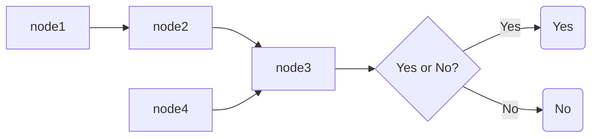
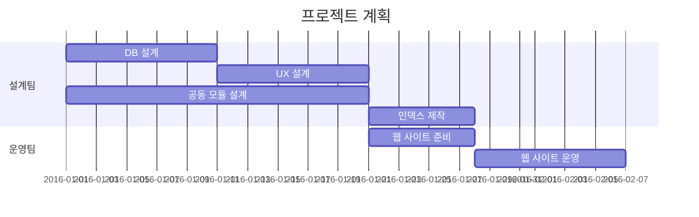

# 마크다운 (MarkDown)


## 1. 마크다운이란?

**[Markdown](http://whatismarkdown.com/)**은 텍스트 기반의 마크업언어로 2004년 존그루버에 의해 만들어졌으며 쉽게 쓰고 읽을 수 있으며 HTML로 변환이 가능하다. 특수기호와 문자를 이용한 매우 간단한 구조의 문법을 사용하여 웹에서도 보다 빠르게 컨텐츠를 작성하고 보다 직관적으로 인식할 수 있다. 마크다운이 최근 각광받기 시작한 이유는 깃헙([https://github.com](https://github.com/)) 덕분이다. 깃헙의 저장소Repository에 관한 정보를 기록하는 README.md는 깃헙을 사용하는 사람이라면 누구나 가장 먼저 접하게 되는 마크다운 문서였다. 마크다운을 통해서 설치방법, 소스코드 설명, 이슈 등을 간단하게 기록하고 가독성을 높일 수 있다는 강점이 부각되면서 점점 여러 곳으로 퍼져가게 된다.


## 2. 문법

### 1. 헤더

```
# This is a H1
## This is a H2     여기까지 헤드밑에 줄이생긴다.
### This is a H3
#### This is a H4
##### This is a H5
###### This is a H6
```

# This is a H1

## This is a H2

### This is a H3

#### This is a H4

##### This is a H5

###### This is a H6


### 2. 블럭인용문자

```
> This is a blockqute.
>> This is a blockqute.
>>> This is a blockqute.
```

> This is a blockqute.
>
> > This is a blockqute.
> >
> > > This is a blockqute.


### 3. 목록

```
1. 첫번째
2. 두번째
3. 세번째
```

1. 첫번째
2. 두번째
3. 세번째

```
* 빨강
+ 노랑
- 파랑     셋다 같음
% TAB으로 들여스기와 내어쓰기가 가능하다.
```

- 빨강
  - 노랑
    - 파랑


### 4. 수평선

```
***
___
---
```

---


### 5. 굵게, 기울이기,밑줄,취소선

```
** 굵게 **
*기울이기*
~~취소선~~
++밑줄++    이게맞으나 안되는거같으니 <u>~</u>로 대채
```

**굵게**

*기울이기*

++밑줄++   <u>밑줄</u>

~~취소선~~


### 6. 코드블럭

~~~
​```
이것은
코드블럭
입니다.
​```

​```c   or  ``` php   등등 언어선택가능
~~~

~~~c
void f(){
  printf(%s,"이것은 c 코드 입니다.")
  }
~~~

~~~
`인라인 코드블럭`
~~~

`인라인 코드블럭`


### 7. 링크

~~~
인라인 링크
[표시할글자](URL주소)
[개복이](www.google.co.kr)

URI 링크
<http://google.co.kr>
<smalljot@naver.com>

내부 링크
[목차](#index)
~~~

[개복이](http://www.google.co.kr)

<http://google.com/>

[목차](#index)


### 8. 이미지,임베딩

~~~

 %사이즈 조절 기능은 없기 때문에 </img> 를 이용
~~~


### 9. 각주

~~~
[^id]:각주에 대한 설명.
~~~

[^id]: 각주에 대한 설명.  
[^이런겁니다.]: 설명이 들어가는자리


### 10. 표

```
Typora 에서는 
Ctrl+T 누르면 간단하게 작성할수있다.

Header 1 | Header 2
--------- | ---------
Content 1 | Content 3
Content 2 | Content 4

테이블 정렬
| Header 1 | Header 2 | Header 3 |
| :-------- | :--------: | --------: |
| Left | Center | Right |
```

| 헤드1  | 헤드2  |      |
| ---- | :--: | ---- |
| 항목1  |      |      |
| 항목2  |      |      |
| 항목3  |      |      |


### 11. flow, sequence, mermaid 라이브러리

```
​``` flow

st=>start: Start
op=>operation: My operation
cond=>condition: Yes or No
en=>end: End

st->op->cond
cond(yes)->op
cond(no)->en
```


```flow
st=>start: Start
op=>operation: My operation
cond=>condition: Yes or No
en=>end: End

st->op->cond
cond(yes)->op
cond(no)->en
```

```
​``` sequence
Me-->Bank: $50
Bank ->>Me: $20
Me -> Bank: $10
note right of Bank: Deposit
note over Me,Bank: Transcation completed...
```


```sequence
Me-->Bank: $50
Bank ->>Me: $20
Me -> Bank: $10
note right of Bank: Deposit
note over Me,Bank: Transcation completed...
```

```
graph LR
A[node1]-->B[node2]
B-->C[node3]
D[node4]-->C
C-->E{Yes or No?}
E-->|Yes| F(Yes)
E-->|No| G(No)

'LR','RL','TB','BT'등의 명명령으로 순서도의 진행방향을 바꿀수있다.
```




```
mermaild gant차트 예시

gantt
	title 프로젝트 계획
	section 설계팀
	DB 설계		:a1,  2016-01-01, 10d
	UX 설계		:a2,  2016-01-11, 10d
	공동 모듈 설계 :a3,  2016-01-01, 20d
	인덱스 제작	:after a2	, 7d
	section 운영팀
	웹 사이트 준비	:b1, 2016-01-21	,7d
	웹 사이트 운영	:after b1, 10d
```





